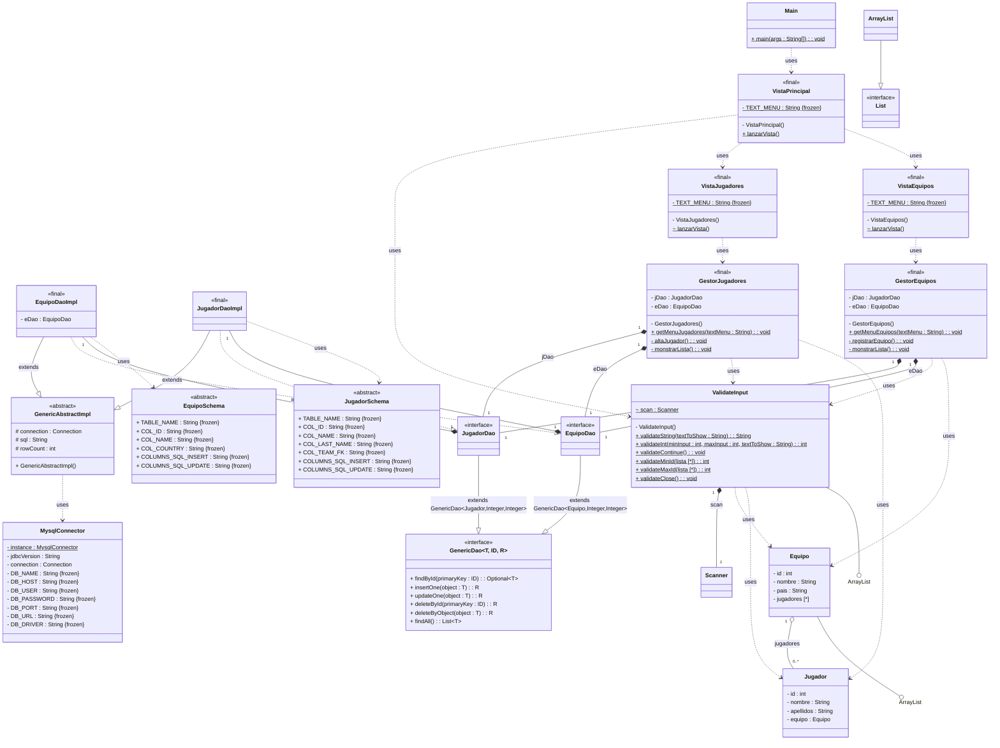

# Sistema de Gestión de Torneos de eSports

## Autor
Emilio Brahim Quechen Romero

https://github.com/eQuechen

 Este proyecto implementa un sistema de gestión de torneos de eSports utilizando UML para el modelado y Java para la implementación.

## Diagramas UML

### Diagrama de Casos de Uso

### Descripción y principios de modelado de casos de uso

Basándonos en las recomendaciones de **Alistair Cockburn** en su libro *Writing Effective Use Cases*, estructuramos nuestros casos de uso empezando por definir con precisión el ámbito y los actores de cada interacción, lo que nos permite, tal como él indica, mantener coherencia y claridad en todo el modelado de requisitos.

### Lo esencial según Cockburn
- **Definir ámbito, actores y objetivos** (user goals).  
- **Establecer precondiciones y garantías** (mínima y de éxito).  
- **Describir el flujo principal y sus extensiones**.

---

### Caso de uso: Registrar equipo

| Campo                  |  Detalle                                                                                                                                                                                                                                                                                                                                                                                                                                                                                                                                                                                                                 |
|------------------------|--------------------------------------------------------------------------------------------------------------------------------------------------------------------------------------------------------------------------------------------------------------------------------------------------------------------------------------------------------------------------------------------------------------------------------------------------------------------------------------------------------------------------------------------------------------------------------------------------------------------------|
| **Actor primario**     | Administrador                                                                                                                                                                                                                                                                                                                                                                                                                                                                                                                                                                                                            |
| **Alcance**            | Módulo de Gestión de Equipos y Jugadores                                                                                                                                                                                                                                                                                                                                                                                                                                                                                                                                                                                 |
| **Nivel**              | User goal                                                                                                                                                                                                                                                                                                                                                                                                                                                                                                                                                                                                                |
| **Partes interesadas** | - **Administrador**: quiere dar de alta el equipo correctamente y verlo de inmediato en las listas.<br>- **Jugadores**: (miembros futuros del equipo) necesitan que exista el registro para poder asociarse y gestionar sus datos.<br>- **Módulo de Gestión de Torneos**: depende de un catálogo de equipos actualizado para inscribirlos y generar emparejamientos.<br>- **Módulo de Gestión de Partidas y Resultados**: valida contra la lista de equipos existentes al registrar resultados.<br>- **Módulo de Gestión de Premios**: necesita conocer los equipos dados de alta para asignarles premios correctamente. |
| **Precondiciones**     | Administrador autenticado.                                                                                                                                                                                                                                                                                                                                                                                                                                                                                                                                                                                               |
| **Garantía mínima**    | El sistema rechaza registros ya existentes.                                                                                                                                                                                                                                                                                                                                                                                                                                                                                                                                                                              |
| **Garantía de éxito**  | Equipo registrado correctamente y visible de inmediato en el catálogo.                                                                                                                                                                                                                                                                                                                                                                                                                                                                                                                                                   |
| **Escenario principal**| 1. El Administrador selecciona “Registrar equipo”.<br>2. El Administrador introduce los datos del equipo.<br>3. El Administrador confirma la creación.<br>4. El sistema valida y persiste el registro.                                                                                                                                                                                                                                                                                                                                                                                                                   |
| **Extensiones**        | 1. **Nombre vacío**: “El nombre es obligatorio”.<br>2. **Nombre duplicado**: “Ese equipo ya existe”.                                                                                                                                                                                                                                                                                                                                                                                                                                                                                                                     |
---

### Caso de uso: Añadir jugador a un equipo

| Campo                  | Detalle                                                                                                                                                                                                                                                                                |
|------------------------|----------------------------------------------------------------------------------------------------------------------------------------------------------------------------------------------------------------------------------------------------------------------------------------|
| **Actor primario**     | Administrador                                                                                                                                                                                                                                                                          |
| **Alcance**            | Módulo de Gestión de Equipos y Jugadores                                                                                                                                                                                                                                               |
| **Nivel**              | User goal                                                                                                                                                                                                                                                                              |
| **Partes interesadas** | - **Administrador**: Quiere asociar jugadores a un equipo.<br>- **Jugadores**: Quieren poder unirse y gestionar sus datos dentro del equipo.<br>- **Módulo de Gestión de Torneos**: Depende de un catálogo de equipos actualizado para inscribirlos y generar emparejamientos.<br>- **Módulo de Gestión de Partidas y Resultados**: Valida contra la lista de equipos existentes cuando registra resultados.<br>- **Módulo de Gestión de Premios**: Necesita conocer los equipos dados de alta para asignarles premios correctamente. |
| **Precondiciones**     | 1. Administrador autenticado.<br>2. Equipo existente en el sistema.                                                                                                                                                                                                                    |
| **Garantía mínima**    | El sistema rechaza registros ya existentes.                                                                                                                                                                                                                                            |
| **Garantía de éxito**  | Jugador registrado correctamente.                                                                                                                                                                                                                                                      |
| **Escenario principal**| 1. El Administrador selecciona “Añadir jugador a un equipo”.<br>2. Selecciona el equipo destino.<br>3. Selecciona el jugador.<br>4. Confirma la operación.<br>5. El sistema valida y persiste el registro.                                                                              |
| **Extensiones**        | **Jugador ya en equipo**: “El jugador ya forma parte de este equipo”.                                                                                                                                                                                                                  |
---

### Caso de uso: Consultar lista de equipos y jugadores

| Campo                  | Detalle                                                                                                                                                                                                                       |
|------------------------|-------------------------------------------------------------------------------------------------------------------------------------------------------------------------------------------------------------------------------|
| **Actor primario**     | Administrador                                                                                                                                                                                                                 |
| **Alcance**            | Módulo de Gestión de Equipos y Jugadores                                                                                                                                                                                     |
| **Nivel**              | User goal                                                                                                                                                                                                                     |
| **Partes interesadas** | - **Administrador**: Quiere visualizar equipos y sus jugadores.<br>- **Jugadores**: Consultan equipos disponibles.<br>- **Módulo de Gestión de Torneos**: Usa la información para validar inscripciones.                     |
| **Precondiciones**     | Administrador autenticado.                                                                                                                                                                                                    |
| **Garantía mínima**    | Mensaje de error y lista vacía.                                                                                                                                                                                               |
| **Garantía de éxito**  | Devuelve la lista completa y actualizada.                                                                                                                                                                                     |
| **Escenario principal**| 1. El Administrador selecciona “Consultar lista de equipos / jugadores”.<br>2. El sistema muestra la lista correspondiente.                                                                                                   |
| **Extensiones**        | 1. **No hay registros**: “Aún no se han introducido datos”.                                                                                                                                                                   |

---


### Análisis del problema y requisitos del sistema
A continuación se responden las preguntas clave requeridas.
<br><br>


#### • ¿Quiénes son los actores que interactúan con el sistema?
 - **Administrador**: Actor principal que realiza todas las operaciones relacionadas con equipos y jugadores.
<br><br>

#### • ¿Cuáles son las acciones el actor puede realizar?
- Registrar un equipo.
- Añadir jugadores a un equipo existente.
- Consultar la lista de equipos y jugadores.
<br><br>

#### • ¿Cómo se relacionan entre sí las entidades del sistema?
- Un **Equipo** está compuesto por una lista de **Jugadores**.
- Los **Jugadores** pertenecen a un único **Equipo**.
- Estas entidades están involucradas en los flujos gestionados por el actor principal a través de los casos de uso.

---


### Modelado de diagramas.
Durante el modelado de los diagramas seguiremos una serie de pautas y reglas establecidas.<br>
Nos basaremos en libros de expertos en UML:
- [**Writing Effective Use Cases** - *Alaistair Cockburn*]
- [**UML Distilled A Brief Guide to the Standard Object Modeling Language** - *Martin Fowler*].

Y en el proceso de ingeniería del software:
- [**Ingeniería del software un enfoque práctico** - *Roger S. Pressman*].

<br><br>
### Consideraciones generales:

> “Los casos de uso se definen desde el punto de vista de un actor. Un actor es un papel que desempeñan las personas (usuarios) o los dispositivos cuando interactúan con el software.”
> <br>“Con una definición más formal, un actor es cualquier cosa que se comunique con el sistema o producto y que sea externo a éste. Todo actor tiene uno o más objetivos cuando utiliza el sistema.”
> - Roger S. Pressman, *Ingeniería del software, un enfoque práctico*, Capítulo 5: Comprensión de los requerimientos, pag 113
---
> “Como primera regla general, usa siempre la relación **includes** entre casos de uso. Las personas que siguen esta regla afirman que ellos y sus lectores tienen menos confusión en su escritura que quienes mezclan **includes**, **extends** y **specializes**.”  
> - Alistair Cockburn, *Writing Effective Use Cases*, Appendix A, pag 207
---
> 1. “Si el desencadenante implica cosas de las que el caso de uso **base** es responsable —es decir, el caso de uso base sabe cuándo/dónde/por qué debe ejecutarse el segundo caso de uso—, entonces el caso de uso base **incluye** al otro.  
> 2. "Si el desencadenante implica cosas de las que el **segundo** caso de uso es responsable —es decir, el segundo caso de uso sabe cuándo/dónde/por qué debe ejecutarse—, entonces el segundo caso de uso extiende al caso de uso base.”  
> - Alistair Cockburn, *Writing Effective Use Cases*, pag 117
---
> “No intentes descomponer casos de uso en subcasos de uso y sub-subcasos de uso utilizando una descomposición funcional. Ese tipo de descomposición es una buena forma de perder mucho tiempo.”  
> - Martin Fowler, *UML Distilled*, Chapter 9 – Use Cases, pag 101
---
> “Para evitar duplicación en casos de uso, por lo general es mejor crear un nuevo caso de uso que represente la actividad duplicada y luego dejar que los otros casos de uso incluyan este nuevo caso de uso como uno de sus pasos.”  
> - Roger S. Pressman, *Ingeniería del software, un enfoque práctico*, Apéndice 1, pag 730

---
<br><br>
### Uso de `<<include>>`:

> “Un paso complicado en un caso de uso puede ser otro caso de uso. En términos de UML, decimos que el primer caso de uso incluye al segundo.”  
> “Los casos de uso incluidos pueden ser útiles para un paso complejo que recargaría el escenario principal o para pasos que se repiten en varios casos de uso.”  
> - Martin Fowler, *UML Distilled*, Chapter 9 – Use Cases, pag 101
---
> “Un caso de uso base incluye a un caso de uso incluido si un paso de acción en el caso de uso base menciona el nombre del caso de uso incluido. Esta es la relación normal y obvia entre un caso de uso de nivel superior y uno de nivel inferior.”  
> - Alistair Cockburn, *Writing Effective Use Cases*, Appendix A, pag 234

 Tanto *Cockburn* como *Martin Fowler* coinciden en que para modelar un caso de uso incluido, debe darse **al menos** una de las siguientes condiciones:
- El caso de uso **siempre** utiliza el caso de uso incluido en cuestión, y además, este, **puede ser reutilizado**.
- Estamos antes un paso complejo que sobrecargaría el escenario principal

<br><br>

### Uso de `<<extends>>`:

> “Crea casos de uso de extensión solo cuando sea necesario, porque son más difíciles de entender y mantener.”  
> > — Alistair Cockburn, *Writing Effective Use Cases*, Chapter 10: Linking Use Cases, pag 116

> “Un caso de uso de extensión no es más que la condición de extensión con su manejo separado y convertido en un caso de uso por sí solo.”  
> > — Alistair Cockburn, *Writing Effective Use Cases*, Appendix A, pag 235

> “Recuerda que el propósito original de **extends** es evitar tener que modificar el caso de uso base.”  
> > — Alistair Cockburn, *Writing Effective Use Cases*, Appendix A, pag 238
---
<br><br>
### Diagrama de Clases
<br>

### Modelado del diagrama de clases

> A continuación se muestra el diagrama de clases del sistema Gestión de Equipos y Jugadores, siguiendo las pautas de **Martin Fowler** en *UML Distilled* para maximizar claridad y coherencia en el diseño.

<br>

### Principales componentes

- **Entidades del dominio**  
  - `Equipo` y `Jugador` con relación de **composición**: un `Equipo` contiene múltiples `Jugador` (1..*) y cada `Jugador` pertenece a un único `Equipo`.  
- **Capa de persistencia**  
  - **DAO genérico** (`GenericDao<T,ID,R>`) como interfaz parametrizada.  
  - **DAO concretos** (`EquipoDao`, `JugadorDao`) que **extienden** `GenericAbstractImpl` y **implementan** la interfaz genérica.  
  - **Esquemas de constantes** (`EquipoSchema`, `JugadorSchema`) definidos como clases **abstractas** de solo lectura (`{frozen}`) para agrupar nombres de tablas y columnas.  
- **Capa de negocio (controladores)**  
  - `GestorEquipos` y `GestorJugadores`, usan composición (`jDao`/`eDao`) para invocar a los DAOs y dejarle la validación a `ValidateInput`.  
- **Capa de utilidades**  
  - `ValidateInput` ofrece métodos estáticos de validación de entrada.
- **Capa de configuración**  
  - `MysqlConnector` gestiona la conexión a base de datos siguiendo el patrón **singleton**.  
- **Capa de presentación (vistas)**  
  - `VistaPrincipal`, `VistaEquipos` y `VistaJugadores` muestran al administrador menús estáticos (`{static final}`) y llaman a los controladores.  
  - `Main` arranca la aplicación invocando `VistaPrincipal`.  
<br>

### Pautas seguidas

- **Composición y dependencia**  
  - Se emplea **composición** (`*--`) para relaciones de propiedad y ciclo de vida compartido.  
  - Se usa **dependencia** (`..>`) para vínculos de uso puntual.  
- **Interfaces y abstracción**  
  - Las interfaces genéricas y los esquemas de constantes se marcan con `«interface»` y `«abstract»`, respectivamente.  
  - Las clases finales y singleton se resaltan con `«final»`.  
- **Visibilidad y estáticos**  
  - Atributos y métodos públicos, protegidos o privados reflejan la visibilidad real del código.  
  - Constantes se señalan como `{frozen}` y atributos estáticos por convención de subrayado o llaves.  

Con este diagrama garantizamos una visión global de la arquitectura en **capas**, las **responsabilidades** de cada clase y la **estructura de dependencias**, facilitando futuras modificaciones y ampliaciones.

<br>

### Detalles y notaciones

- **Realización de interfaces**  
  > Los DAOs (`EquipoDao`, `JugadorDao`) se marcan con `«interface»` y las implementaciones (`EquipoDaoImpl`, `JugadorDaoImpl`) usan la flecha punteada de realización (`..|>`) en lugar de la “roseta” (lollipop). Esto refuerza que el contrato se cumple en tiempo de compilación, no en tiempo de ejecución.
  
- **Parámetros genéricos**  
  > Siguiendo las buenas prácticas de Roger Pressman en cuanto a **modularidad** y **reutilización** de código, la interfaz genérica `GenericDao<T,ID,R>` encapsula las operaciones CRUD comunes y se adapta a cualquier entidad, evitando duplicar lógica y mejorando la mantenibilidad del sistema.  
  
- **Composición fuerte y multiplicidades**  
  > - La flecha sólida `*--` (composición) entre `GestorEquipos`/`GestorJugadores` y sus DAOs (`jDao`, `eDao`) deja claro que hablamos de propiedad exclusiva y ciclo de vida compartido, ya que la cardinalidad es `"1" *-- "1"`.  
  > - La relación `Equipo "1" o-- "0..*" Jugador : jugadores` muestra una agregación ligera (rombo hueco) con multiplicidad: un equipo agrupa cero o más jugadores, entiendo esto debido a la estructura lso casos de uso.

- **Clases de constantes inmutables**  
  > `EquipoSchema` y `JugadorSchema` son clases `«abstract»` cuyo compartimento de atributos agrupa sólo `static final` marcadas con `{frozen}`. Por lo que sus valores no cambian tras la inicialización y no pueden ser instanciadas.

- **Singleton y utilidades**  
  > - `MysqlConnector` se modela con dependencia (`..>`) desde `GenericAbstractImpl`, y sus atributos privados representan el patrón singleton (`– instance : MysqlConnector`).  
  > - `ValidateInput` incluye una composición (`"1" *-- "1" Scanner : scan`) para compartir un único `Scanner` entre todos sus métodos estáticos.

De esta manera, ilustro, no solo la estructura básica, sino también conceptos UML más avanzados (realización, genéricos, composición vs. agregación, inmutabilidad y patrones de diseño), haciendo el diagrama rico y preciso sin sacrificar legibilidad, siempre siguiendo las pautas de los libros mencionados.

<br>

### Diagrama de clases (código Mermaid)


<br>

## Estructura de directorios

```text
torneo-esports-uml/
├── src/
│   ├── diagrams/
│   │   └── codigo/
│   │       ├── anadir_jugador.png
│   │       ├── clases.png
│   │       ├── consultar_lista.png
│   │       └── registrar_equipo.png
│   └── main/
│       ├── java/
│       │   └── es/empresa/torneo/
│       │       ├── control/
│       │       │   ├── GestorEquipos.java
│       │       │   └── GestorJugadores.java
│       │       ├── modelo/
│       │       │   ├── Equipo.java
│       │       │   └── Jugador.java
│       │       ├── persistencia/
│       │       │   ├── config/
│       │       │   │   └── MysqlConnector.java
│       │       │   ├── constants/
│       │       │   │   ├── EquipoSchema.java
│       │       │   │   └── JugadorSchema.java
│       │       │   ├── dao/
│       │       │   │   ├── GenericDao.java
│       │       │   │   ├── EquipoDao.java
│       │       │   │   └── JugadorDao.java
│       │       │   ├── impl/
│       │       │   │   ├── GenericAbstractImpl.java
│       │       │   │   ├── EquipoDaoImpl.java
│       │       │   │   └── JugadorDaoImpl.java
│       │       │   └── util/
│       │       │       └── ValidateInput.java
│       │       ├── vista/
│       │       │   ├── VistaEquipos.java
│       │       │   ├── VistaJugadores.java
│       │       │   └── VistaPrincipal.java
│       │       └── Main.java
│       └── resources/
│           └── ddl_esports_mysql.sql
├── .gitignore
├── pom.xml
└── README.md
```

## Instalación y Ejecución

1. Clonar el repositorio:

`git clone https://github.com/eQuechen/torneo-esports-uml.git`

2. Compilar y ejecutar el proyecto:

`cd src javac src/main/java/es/empresa/torneo/Main.java java src.main.java.es.empresa.torneo.Main`

3. Para establecer conexión con las BBDD correctamente a través del proyecto Java "torneo-esports-uml" se debe hacer lo siguiente:

#### Configuración Java

3A. Crear las variables de entorno:
```text
MYSQL_DB_NAME=esports_mysql;
MYSQL_DB_HOST=localhost;
MYSQL_USER=root;
MYSQL_PASSWORD=mysql;
MYSQL_DB_PORT=3306;
```
		
3B. Copiar y pegar en run/debug configurations si se usa Inteliij:
```text
MYSQL_DB_HOST=localhost;MYSQL_DB_NAME=esports_mysql;MYSQL_DB_PASSWORD=mysql;MYSQL_DB_PORT=3306;MYSQL_DB_USER=root
```
#### Configuración MySQL

- Instalar y ejecutar un contenedor de Docker con una imagen de MySQL:
```text
docker run --name mysql-container -e MYSQL_ROOT_PASSWORD=mysql -d -p 3306:3306 mysql:latest
```

- Crear la conexión con MySQL en tu IDE:.
```text
En el caso de DataGrip, seleccionar:

1. DataBase explorer.
2. New
3. Data-Source
4. MySQL
5. Introducir los datos del paso 3.A si seguiste la instalación del
contenedor Docker, en caso contrario los que hayas establecido en tu BBDD.
```
	
- Ejecutar en tu IDE el script .sql (DDL) que se encuentra en la ruta del proyecto:
>  src/main/resources/ddl_esports_mysql.sql
